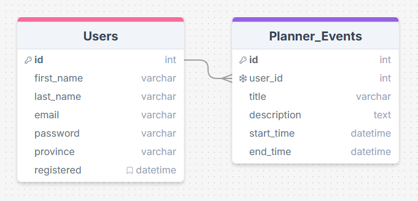

# Project Title

## Overview

My app is designed to help teachers create and manage, teaching and lesson plans.

### Problem

Teachers in BC are not provided with any organizational resources to structure their lesson plans around. They are given a loose definition of what the teaching objectives are for each grade, and what competencies to observe. These "curriculum outlines" are not organized or grouped together by grade but rather by subject; making them a pain to aggregate, while building a teaching plan. There are no recomendations given on how to structure and organize a lesson plan; which is a point of difficulty for most new teachers.

Being a teacher requires planning on many levels: Year-long curriculum goals, monthly unit schedules, weekly lesson organization, and daily planners are just a few examples that my app is aimed to assist with.

Many teachers resort to using purchased spreadsheet templates. These can be pricey, and restrictive. Having a resource that is easy to personalize to their preference would be an asset for many educators.

### User Profile

My app is meant for use by teachers (teaching in BC, Canada), in all grades (K - 12). It's purpose is to provide a structure by which teachers can create and organize their lesson plans. It will also provide easy access to the "curriculum outlines" that pertain to the specific grade selected for their plan.

### Features

-   User accounts to allow for persisting plans.
-   Year, week, and day 'at-a-glance' views (YAAG, WAAG, and DAAG).
-   Ability to set days off, and pro-d days
-   Automatic inclusion of Canadian statutory holidays, by province.
-   Ability to define 'Big Ideas' and 'Learning Metrics' for the year.
-   Ability to add text notes to the day plan.

> ![IMPORTANT]
> Next-up features, to be included as time permits:
>
> -   Repository for collected resources, and resource links:
> -   ability to link resources to a specific lesson, making them available through the DAAG page (ex. providing a link to a video resource from within a menu in the DAAG plan).

## Implementation

### Tech Stack

-   React
-   JavaScript
-   MySQL
-   Express
-   Client libraries:
    -   react
    -   react-router
    -   FullCalendar
    -   moment
    -   axios
    -   Tailwind CSS
    -   Flowbite
-   Server libraries:
    -   node.js
    -   express
    -   knex

### APIs

[Canadian Holidays API](https://canada-holidays.ca/api/v1/)

-   provides statutory holiday schedule on a Province basis
-   offers english and french holiday names

[Google Gemini AI](https://ai.google.dev/gemini-api/docs)

> [!IMPORTANT]
> AI features are considered 'nice-to-have', and will be added if time permits.

### Sitemap

-   Create Account
-   Login
-   Dashboard (Year View)
-   User Profile
-   My Resources
-   My Month
-   My Day

### Data

Each user profile will be associated with a planner table, in a 1:1 relationship.

> [!IMPORTANT]
> Future versions will allow each user profile to create multiple planners, in a 1:n relationship.

### Endpoints

-   POST NewUser

    -   Create a new user profile with name, ID, email, and password.

-   GET User

    -   On login: get user data such as name, and planner ID.

-   POST NewPlannerEvent

    -   Add a new planner event.

-   GET PlannerEvents

    -   Get the list of all planned events, for a specific user.

-   DELETE RemovePlannerEvent

    -   Remove an event from the 'Planner_Events' table.

> [!IMPORTANT]
> Additional endpoints to be added, time permiting:
>
> POST EditUser
>
> -   Update user data.
>
> DELETE DeleteUserAccount
>
> -   Delete a user's account, and associated data.
>
> POST UpdatePlannerEvent
>
> -   Edit the details of an event.

### Auth

-   JWT auth
    -   Stored in cookies, with expiry of 24 hours.

## Roadmap

Sprint-1 (Aug 19th - Aug 25 )

-   Git repo and base file structure
-   create database
-   app navigation
-   server routing
-   Knex seeds and migrations

Sprint-2 (Aug 26 - Sep 01)

-   GET PlannerEvents endpoint
-   POST NewPlannerEvent endpoint
-   test endpoints
-   create 'Header' component
-   create 'Dashboard' (year view) component
-   create 'MyMonth' page
-   create 'MyDay' page
-   page styling
-   test responsiveness at multiple screen sizes

Sprint-3 (Sep 02 - Sep 08th)

-   add Auth
-   'Login' page
-   'Create Account' page
-   POST NewUser endpoint
-   GET User endpoint
-   test further endpoints
-   test auth

## Feature Wishlist (in no specific order)

-   AI integration
-   User image
-   Province selection (for curriculum guidelines and statutory holidays)
-   Darkmode
-   'My Month' view
-   Ability to divide the year into terms or semesters, as needed.
-   Better delivery of grade-relevant resources
-   Ability for users to add, or link their own resources
-   Reuseable lesson plans
-   Save multiple teaching plans
-   React Native app
-   Typescript
-   Accessibility
-   OAuth (Google)
-   Renew auth cookie expiration time if User logs in before expiry.
-   POST EditUser
-   DELETE DeleteUserAccount
-   POST UpdatePlannerEvent

## Challenges

-   Skill limitations: This proposal pushes my skills and understanding in pretty much every area. Many of the libraries and APIs are new to me. I will need to take care to avoid getting in over my head on any one feature. Deciding when to pivot away from a task that exceeds my current abilities will be key to staying on-schedule.

-   Scope Creep: Due to the hard deadline on this project it will be critical to keep the scope reasonable, and realistic. This will mean prioritizing core features, tracking progress daily, and pruning secondary features as necessary. Time management is an area that I struggle with especially; making it a top priority for this project.
